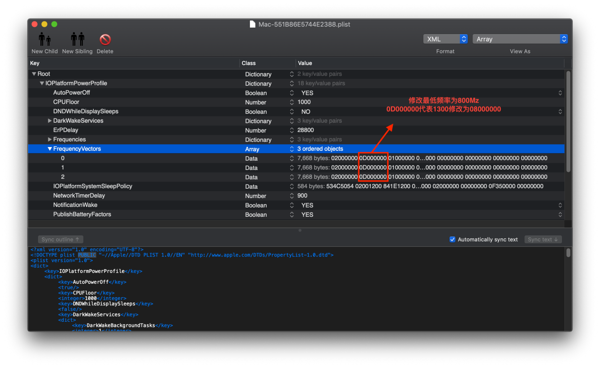

# Lenovo 小新 Air 13IWL

| 系统   | macOS Mojave 10.14.5                            | 18F132    |
| ------ | ----------------------------------------------- | --------- |
| CPU    | Intel(R) Core(TM) i5-8265U 1.60GHz Turbo 3.9Ghz | 4C8T      |
| 内存   | Samsung 4GB x 2  Dual Channel 1867MHz~2133MHz   | LPDDR3    |
| 硬盘   | HFS256GD9TNG-62A0A 250G Nvme SSD                | 1C5C:1527 |
| 显卡   | Intel UHD Graphics 620 Whiskey Lake-U GT2       | 8086:3EA0 |
| 声卡   | Realtek ALC236                                  | 10EC:0236 |
| 网卡   | 更换Dell DW1820A BCM4350                        | 14E4:43A3 |
| 蓝牙   | 更换Dell DW1820A BCM2045A0                      | 0A5C:6412 |
| 键盘   | PS/2 标准键盘                                   | MSFT0001  |
| 触控板 | Intel I2C HID                                   | INT34BB   |
| 显示器 | AU Optronics B133HAN05.A 13.3 FHD 1920x1080     | 6AF:5A2D  |
| 摄像头 | Integrated Camera                               | 04F2:B61E |

## CPU : Intel(R) Core(TM) i5-8265U 1.60GHz Turbo 3.9Ghz 4C8T  

### 驱动 : CPUFriend.kext , CPUFriendProvider.kext

### 补丁 : SSDT-XCPM.aml

1.终端执行脚本freqVectorsEdit.sh输入密码,选nano继续,记下高亮绿色的机型Mac-.plist选择一个合适的记下,查看即可不要继续执行,关闭终端;

2./System/Library/Extensions/IOPlatfromPluginFamily.kext/Contents/Pluglns/X86PlatformPlugin.kext/Contents/Resources拷贝选择的变频文件 Mac-.plist到桌面，修改最低频率为800Mhz ;

3.终端执行脚本ResourceConverter.sh --kext Mac-.plist ;

4.得到CPUFriendProvider.kext (默认输出至用户名主目录下) ;

5.所需脚本在 附件/CPU/ ,变频正常, 双系统切换需要关机切换否则会有高频不降现象. 

