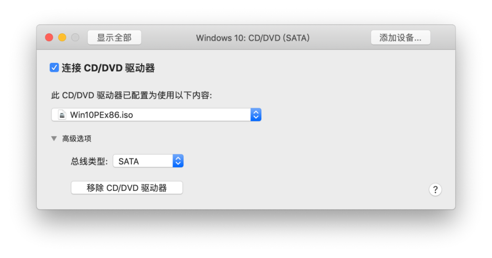

# 虚拟机上传蓝牙固件

(xlivans)

以DW1820A的蓝牙BCM2045A0 ID : 0A5C , 6412为例

## 准备工作

1.首先确保蓝牙不能丢失(包括睡眠唤醒),

Clover使用的是空壳驱动BrcmBluetoothInjector.kext,固件显示为4096

OC需要使用BrcmFirmwareData.kext , BrcmPatchRAM2.kext , BrcmBluetoothInjector.kext , 固件显示为5799

驱动下载地址 https://github.com/headkaze/OS-X-BrcmPatchRAM/releases

2.官网下载VMware Fusion 序列号7HYY8-Z8WWY-F1MAN-ECKNY-LUXYX

https://download3.vmware.com/software/fusion/file/VMware-Fusion-11.1.0-13668589.dmg

3.准备Windows10安装镜像,推荐一个精简版地址,安装设置完后2.3G左右大小

链接: https://pan.baidu.com/s/19EZKgJ1yW5WTDWyTnfu5fA  提取码: xpkr  

4.准备WinPE.iso哪家的都行 下载dism++ 

http://www.chuyu.me/zh-Hans/index.html

5.创建自定义虚拟机-Windows 10-传统BIOS-新建虚拟磁盘-完成

6.关闭虚拟机-设置虚拟机

  

7.找到刚才创建的虚拟机文件,显示包内容,文本编辑器打开.vmx 文件结尾处加入一行代码内容为usb.autoConnect.device0 = "vid:0a5c pid:6412"

8.解压dims++ 和下载好的精简版系统esd文件、蓝牙驱动 放入U盘

9.运行虚拟机-进入PE后对硬盘进行分区

10.插入U盘 - 连接到 Windows

11.运行U盘内的dism++

12.确定-确定 等待释放完成后 ,重启虚拟机,等待自动安装Win10进入桌面后, 安装蓝牙驱动,激活系统,关闭虚拟内存,重启虚拟机查看激活状态 !

13.关闭虚拟机-虚拟机设置-常规-清理虚拟机

14.设置开机,睡眠唤醒自动隐藏启动并关闭虚拟机 !

使用系统自带 脚本编辑器写入脚本,内容为

**tell** *application* "Terminal"

**do script** "vmrun start BCM2045A0.vmwarevm nogui"

**delay** 30

**do script** "vmrun stop BCM2045A0.vmwarevm"

**end** **tell**

**delay** 5

**tell** *application* "Terminal"

**quit**

**end** **tell**

**其中Delay 30为虚拟机开机关闭间隔30秒 可以根据自己虚拟机开机时间实际情况设定延时**

虚拟机 BCM2045A0.vmwarevm 的路径名称根据自己实际情况修改,导出为应用程序,运行一次

  

15.睡眠唤醒自动运行 

终端执行命令

/usr/bin/ruby -e "$(curl -fsSL [https://raw.githubusercontent.com/Homebrew/install/master/install)"](https://raw.githubusercontent.com/Homebrew/install/master/install)\)

brew install sleepwatcher

vi ~/.wakeup 

按键盘i键进入插入模式写入内容

 

app路径名字以自己实际情况为准,输入完成后按键盘esc输入 :wq! 回车 保存退出

终端执行chmod +x .wakeup 更改权限

16.到此完成所有操作,使用说明

 Clover 使用的是空壳驱动固件为4096,空壳驱动有大概10cm左右的距离限制,这本身是个错误的驱动方式,在开机和睡眠唤醒启动虚拟机之间有个间隙,大概1~3秒,在这个间隙蓝牙的固件为4096,此时不能让蓝牙外设连接到系统否则即使通过虚拟机上传完固件连接上的外设也不能用 ,所以需要耐心等待蓝牙固件上传完成;

OC由于使用了BrcmPatchRAM2来上传固件以保证睡眠唤醒蓝牙设备不丢失,是正确的驱动方式,所以没有1~3秒的连接限制,不过依然要等待固件上传完成才能正常使用

 

 

 

 